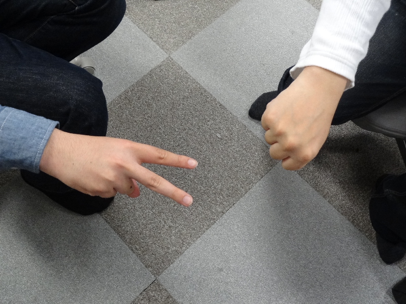

# Automatic_Janken

### じゃんけん画像の自動判別

手の画像を入力とし、自動で手の座標とグーチョキパーの判定を行う

上のような画像の場合の出力は

$ ./a.exe sample1.ppm

75 251 310 134 t l

512 128 175 559 g w

矩形の座標と、手の形と、勝敗になる。

g = グー、t = チョキ、 p = パー

w = 勝者、 w = 敗者
